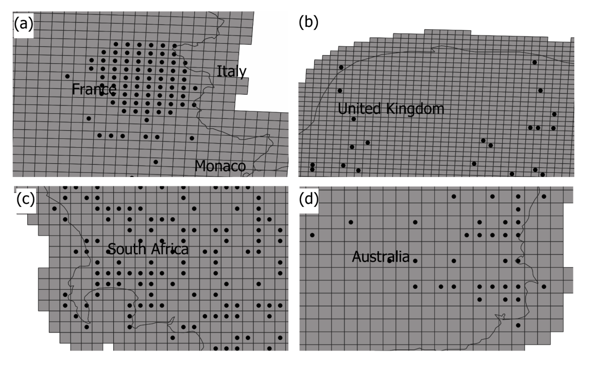

name: hello
class: middle, center, inverse

#### `r rmarkdown::metadata$author`


Pesquisadora e Cientista de Dados <br>
Atuação: Biodiversidade e Mudanças Globais <br>
Bióloga | MSc. Biologia Ambiental | PhD. in Zoologia <br> 

[`r fontawesome::fa("github")` @Tai-Rocha](https://github.com/Tai-Rocha)    
[`r fontawesome::fa("twitter")` @Tai_Rocha_](https://twitter.com/Tai_Rocha_)   
[`r fontawesome::fa("link")` tainaweb-en.netlify.app](https://tainaweb-en.netlify.app/)
---
Ferramenta para melhorar dados de grade ([GBIF](https://www.gbif.org/))
<br/>
.pull-left[
```{r gridder_3, echo=FALSE, fig.align='center', out.width="50%"}
knitr::include_graphics("images/logo.png")
```
]

```{r paper, echo=FALSE, fig.align='center', out.width="50%"}
knitr::include_url("https://ecoevorxiv.org/6qy5u/", height = 450)
```
---
<br/>
.pull-left[
```{r gridder, echo=FALSE, fig.align='center', out.width="50%"}
knitr::include_graphics("images/logo.png")
```
]

- Rastrear pontos em grade

- Quantificar variação geográfica e ambiental 

.pull-right[

```{r sisgrades, echo=FALSE, fig.align='left', out.width="100%"}

```
]
---

class: chapter-slide

# Instalação e funções do pacote

---
#### Instalação

```{r install package, echo= TRUE, warning=FALSE, eval=FALSE}
# remotes::install_github("BiogeographyLab/gridder")
```
---
#### Dados do pacote  

```{r data, warning=FALSE, echo=TRUE, message=FALSE}
library(gridder)
data("occs_unique") 
data("ne_10m_admin_0_countries")
```
---
#### Visulizando os dados

```{r data_plot, warning=FALSE, echo=FALSE, fig.align='center', fig.width=8,fig.height=8}
library(ggplot2)
library(broom)
spdf_fortified = tidy(ne_10m_admin_0_countries, region = "ADMIN")
ggplot() +
  geom_polygon(data = spdf_fortified, 
               aes( x = long, y = lat, group = group), 
               fill="#69b3a2", color="white") +
  geom_point(data = occs_unique,
             aes(x = decimalLongitude, y = decimalLatitude), 
             size = 2, 
        shape = 23, fill = "darkred") +
    coord_sf(xlim = c(-10, 20), ylim = c(40, 60), expand = FALSE)
```
---
### `infer_crs`

Inferir o CRS (sistema de referência de coordenadas)

```{r infer_crs, echo=TRUE, eval=FALSE}

# results_crs = gridder::infer_crs(occ_path = occs_unique, cup_num = 4) 

# readr::write_rds(mtcars, "latinr_proposal/results_crs.rds", "xz", compression = 9L)

```
---
### `infer_crs`

Vamos ler o resultado que está salvo em .rds

```{r results_crs, echo=TRUE, warning=TRUE}
results_crs = readRDS("latinr_proposal/results_crs.rds")

print(results_crs$selected[1:5, c("code", "note")])
```
---
### `infer_resolution`

Inferir a resolução espacial 

```{r infer_resolution_1, echo=FALSE, warning=FALSE, message=FALSE}
input_occ = gridder::load_occ(occs_unique)

input_occ_prj = sp::spTransform(input_occ,
                                crs(paste0("+init=epsg:","2154"))
                                )
```

```{r infer_resolution_3, echo=TRUE}
result_res=gridder::infer_resolution(input_coord = input_occ_prj@coords,
                                       flag_unit="meter")
print(result_res$res_x)

print(result_res$res_y)

```

---
### `infer_extent`

Inferir a extensão espacial 

```{r infer_extent, echo=TRUE}
result_ext = gridder::infer_extent(method="crs_extent",
                           crs_grid=2154,
                           flag_adjust_by_res=TRUE,
                           res_x=result_res$res_x,
                           res_y=result_res$res_y)
 
print(result_ext)
```
---
### `grid_generation`

Simulando um sistema de grade baseado em metadados

```{r grid_generation}
simulated_grid = gridder::grid_generation(res_x=40000,
                                           res_y=20000,
                                           unit="m",
                                           flag_crs=TRUE,
                                           country="France",
                                           extent_unit="empirical_occ_extent",
                                           input_extent=result_ext,
                                           crs_num=2154,
                                           flag_maskByCountry=TRUE)
```
---
### `grid_generation`

```{r check simulated, echo= TRUE, fig.width=5,fig.height=5, fig.align='center'}
plot(simulated_grid,
   xlim=c(extent(input_occ_prj)[1],extent(input_occ_prj)[1]+110000),
   ylim=c(extent(input_occ_prj)[3],extent(input_occ_prj)[3]+110000))

plot(input_occ_prj,add=T,col="red")
```

---
##### Calculando a variação ambiental de um sistema de grade

```{r initi, echo=FALSE, warning=FALSE, message=FALSE, results= "hide"}
rgee::ee_Initialize()
```

Sist. de grade disponibilizado no pacote

```{r gri_id_9, echo=TRUE, warning=FALSE, fig.align='center', fig.width=6,fig.height=6}
data("grid_ID_9")
plot(grid_ID_9)
```

```{r sf_as_ee, echo=FALSE, message=FALSE, warning=FALSE}
grid = grid_ID_9 |> 
  rgee::sf_as_ee()
```

---
Variação da elevação para o sistema de grade (grid_id_9)

```{r rgee_nasaden, echo=TRUE}
nasadem = rgee::ee$Image('NASA/NASADEM_HGT/001')$select('elevation')  
```

`assess_env_uncertainty`
  
```{r uncert, echo=TRUE}
std_dev = gridder::assess_env_uncertainty(x= nasadem, y= grid)
```
---
### `assess_env_uncertainty`
```{r uncert_2, echo=TRUE}
print(std_dev, n=3)
```
---
Visualizando a variação da elevação no espaço geográfico

```{r uncert_plot, echo= FALSE, fig.align='center', fig.width=8,fig.height=8}
library(ggplot2)
ggplot(data = grid_ID_9) +
  geom_sf(aes(fill = std_dev$elevation))+
  scale_fill_viridis_c(option = "plasma", trans = "sqrt")
```
---
class: middle, inverse, title-slide

.pull-left[
<br/>
<br/>
<br/>
<br/>
# Obrigada! Gracías
<br/>

]

.pull-right[

### `r rmarkdown::metadata$author`
<br/>
<br/>


### `r rmarkdown::metadata$role`

### `r rmarkdown::metadata$org`

[`r fontawesome::fa("github")` @Tai-Rocha](https://github.com/Tai-Rocha)    
[`r fontawesome::fa("twitter")` @Tai_Rocha_](https://twitter.com/Tai_Rocha_)   
[`r fontawesome::fa("link")` tainaweb-en.netlify.app](https://tainaweb-en.netlify.app/)
]
