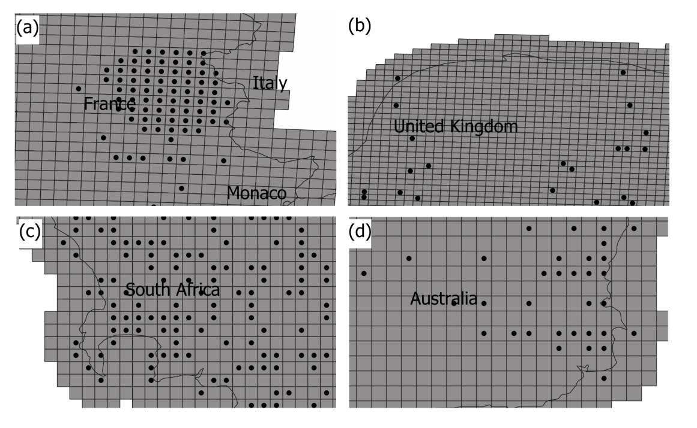

name: hello
class: middle, center, inverse

#### `r rmarkdown::metadata$author`


Pesquisadora e Cientista de Dados <br>
Atuação: Biodiversidade e Mudanças Globais <br>
Bióloga | MSc. Biologia Ambiental | PhD. in Zoologia <br> 

[`r fontawesome::fa("github")` @Tai-Rocha](https://github.com/Tai-Rocha)    
[`r fontawesome::fa("twitter")` @Tai_Rocha_](https://twitter.com/Tai_Rocha_)   
[`r fontawesome::fa("link")` tainaweb-en.netlify.app](https://tainaweb-en.netlify.app/)
---
[GridDER: Grid Detection and Evaluation in R, 2022](https://ecoevorxiv.org/6qy5u/)
<br/>
<br/>
.pull-left[
```{r gridder, echo=FALSE, fig.align='center', out.width="50%"}
knitr::include_graphics("images/logo.png")
```
]
Uma solução para melhorar o uso dos dados do GBIF pelos usuários:

- Rastrear pontos em grade

- Quantificar incerteza geográfica e ambiental 
---
[GridDER: Grid Detection and Evaluation in R, 2022](https://ecoevorxiv.org/6qy5u/)
<br/>
<br/>
.pull-left[
```{r gridder_2, echo=FALSE, fig.align='center', out.width="50%"}
knitr::include_graphics("images/logo.png")
```
]
Ex.: Dados de grade GBIF
```{r sisgrades, echo=FALSE, fig.align='center', out.width="50%"}

```
---

class: chapter-slide

# Instação e funções do pacote

---
#### Instalação

```{r install package, echo= TRUE,warning=FALSE,eval=FALSE}
# remotes::install_github("BiogeographyLab/gridder")
```
---
#### Dados  

```{r data, warning=FALSE, echo=TRUE}
library(gridder)
data("occs_unique") 
data("ne_10m_admin_0_countries")
```
---
#### Dados de ocorrência 

```{r occs_unique, warning=TRUE, echo=TRUE}
print(occs_unique, n=5)
```
---
#### Shapefile dos países

```{r shape, warning=TRUE, echo=TRUE}
ne_10m_admin_0_countries
```
---
#### Visulizando os pontos no shapefile

```{r code_plot, warning=FALSE, echo=TRUE,fig.width=5,fig.height=5}
library(ggplot2)
library(broom)


spdf_fortified = tidy(ne_10m_admin_0_countries, region = "ADMIN")
ggplot() +
  geom_polygon(data = spdf_fortified, 
               aes( x = long, y = lat, group = group), 
               fill="#69b3a2", color="white") +
  geom_point(data = occs_unique,
             aes(x = decimalLongitude, y = decimalLatitude), 
             size = 2, 
        shape = 23, fill = "darkred") +
    coord_sf(xlim = c(-10, 20), ylim = c(40, 60), expand = FALSE)
```
---
#### Visulizando os pontos no shapefile

```{r data_plot, warning=FALSE, echo=FALSE, fig.align='center', fig.width=8,fig.height=8}
library(ggplot2)
library(broom)
spdf_fortified = tidy(ne_10m_admin_0_countries, region = "ADMIN")
ggplot() +
  geom_polygon(data = spdf_fortified, 
               aes( x = long, y = lat, group = group), 
               fill="#69b3a2", color="white") +
  geom_point(data = occs_unique,
             aes(x = decimalLongitude, y = decimalLatitude), 
             size = 2, 
        shape = 23, fill = "darkred") +
    coord_sf(xlim = c(-10, 20), ylim = c(40, 60), expand = FALSE)
```
---
### `infer_crs`

Inferir o CRS (sistema de referência de coordenadas)

```{r infer_crs, echo=TRUE, eval=FALSE}
# results_crs = gridder::infer_crs(occ_path = occs_unique, cup_num = 2) 
```
---
### `infer_crs`

Vamos ler o resultado que está salvo em .rds

```{r results_crs, echo=TRUE, eval=FALSE, warning=TRUE}
#results_crs = readRDS("results_crs")
#print(results_crs$selected[1:5, c("code", "note")])
```
---
### `infer_resolution`

Ler as ocorrências como objeto espacial 

```{r infer_resolution_1, echo=TRUE, warning=FALSE}

input_occ = gridder::load_occ(occs_unique)
```
---
### `infer_resolution`

Atribuindo o CRS correto 

```{r infer_resolution_2, echo=TRUE, warning=FALSE}
input_occ_prj = sp::spTransform(input_occ,
                                crs(paste0("+init=epsg:","2154"))
                                )
```
---
### `infer_resolution`

Inferir a resolução espacial 

```{r infer_resolution_3, echo=TRUE}
result_res=gridder::infer_resolution(input_coord = input_occ_prj@coords,
                                       flag_unit="meter")
print(result_res$res_x)

```

---
### `infer_extent`

Inferir a extensão espacial 

```{r infer_extent, echo=TRUE}
# result_ext = gridder::infer_extent(method="crs_extent",
#                           crs_grid=results_crs$selected$code[1],
#                           flag_adjust_by_res=TRUE,
#                           res_x=result_res$res_x,
#                           res_y=result_res$res_y)
# 
# print(result_ext)

```
---
### `grid_generation`

Simulando um sistema de grade baseado em metadados

```{r metadata, echo=TRUE}


```

---
### `grid_generation`

Simulando um sistema de grade baseado em metadados

```{r grid_generation}
# simulated_grid = gridder::grid_generation(res_x=result_res$res_x,
#                                           res_y=result_res$res_y,
#                                           unit="m",
#                                           flag_crs=TRUE,
#                                           country="France",
#                                           extent_unit="empirical_occ_extent",
#                                           input_extent=result_ext,
#                                           flag_offset=c(0,-result_res$res_y*10,
#                                                         result_res$res_x*10,0),
#                                           crs_num=results_crs$selected$code[1],
#                                           flag_maskByCountry=TRUE)
```
---
### `grid_generation`

Checando o sistema de grade simulada com as ocorrências

```{r check simulated, echo= TRUE}
# plot(simulated_grid,
#       xlim=c(extent(input_occ_prj)[1],extent(input_occ_prj)[1]+110000),
#       ylim=c(extent(input_occ_prj)[3],extent(input_occ_prj)[3]+110000))
# plot(input_occ_prj,add=T,col="red")
```

---
##### Calculando a variação ambiental de um sistema de grade

Usamos algumas funções baseadas no pacote rgee. Por isso começamos executando a função `ee_Initialize` 

```{r initi, echo=TRUE}
rgee::ee_Initialize()
```
---

`grid_ID_9`, exp. de grade disponibilizado no pacote

```{r gri_id_9, echo=TRUE, warning=FALSE, fig.align='center', fig.width=6,fig.height=6}
data("grid_ID_9")
plot(grid_ID_9)
```
---

Transformando o grid_Id_9 em objeto de imagem "leǵivel" para o rgee (GEE)
```{r sf_as_ee, echo=TRUE}
grid = grid_ID_9 |> 
  rgee::sf_as_ee()
```
---
Read a global elevation data in 30 meters. We do not plot due to extension and resolution

```{r rgee_nasaden, echo=TRUE}
nasadem = rgee::ee$Image('NASA/NASADEM_HGT/001')$select('elevation')  
```
---
### `assess_env_uncertainty`
  
```{r uncert, echo=TRUE}
std_dev = gridder::assess_env_uncertainty(x= nasadem, y= grid)
```
---
### `assess_env_uncertainty`
```{r uncert_2, echo=TRUE}
print(std_dev, n=5)
```
print(std_dev, n=5)
---

Visualizando a variação ambiental no espaço geográfico
<br/>
<br/>
<br/>
```{r uncert_plot_code, echo=TRUE, eval=FALSE}
library(ggplot2)
ggplot(data = grid_ID_9) +
  geom_sf(aes(fill = std_dev$elevation))+
  scale_fill_viridis_c(option = "plasma", trans = "sqrt")
```

---
Visualizando a variação ambiental no espaço geográfico

```{r uncert_plot, echo= FALSE, fig.align='center', fig.width=8,fig.height=8}
library(ggplot2)
ggplot(data = grid_ID_9) +
  geom_sf(aes(fill = std_dev$elevation))+
  scale_fill_viridis_c(option = "plasma", trans = "sqrt")
```
---
class: middle, inverse, title-slide

.pull-left[
<br/>
<br/>
<br/>
<br/>
# Obrigada! Gracías
<br/>

]

.pull-right[

### `r rmarkdown::metadata$author`
<br/>
<br/>


### `r rmarkdown::metadata$role`

### `r rmarkdown::metadata$org`

[`r fontawesome::fa("github")` @Tai-Rocha](https://github.com/Tai-Rocha)    
[`r fontawesome::fa("twitter")` @Tai_Rocha_](https://twitter.com/Tai_Rocha_)   
[`r fontawesome::fa("link")` tainaweb-en.netlify.app](https://tainaweb-en.netlify.app/)
]
